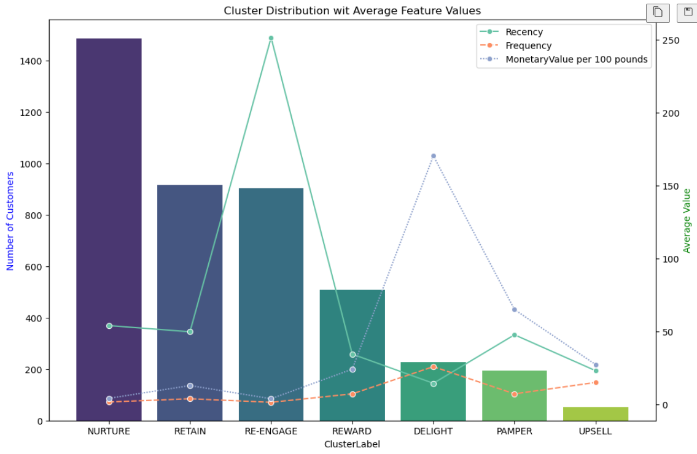

# Customer Segmentation using K-Means Clustering

## Project Overview
This project focuses on identifying distinct customer personas within a retail dataset to drive targeted marketing strategies. Using an **RFM (Recency, Frequency, Monetary)** framework, I processed raw transactional data to quantify customer value and engagement. By applying the **K-Means Clustering** algorithm, I segmented the customer base into actionable groups, providing data-driven business insights.

## Features
- **RFM Analysis:** Transformed transactional logs into Recency, Frequency, and Monetary metrics.
- **K-Means Clustering:** Implemented the K-Means algorithm for unsupervised machine learning.
- **Optimal Cluster Selection:** Utilized the Elbow Method (WCSS) to determine the mathematically ideal number of segments.
- **Data Preprocessing:** Automated handling of missing values and feature scaling using `StandardScaler`.
- **In-depth Visualization:** Created dual-axis charts to compare cluster counts against average feature values.
- **Persona Identification:** Categorized customers into segments like 'High-Value' and 'At-Risk'.

## Tech Stack
- **Language:** Python
- **Libraries:** Pandas, NumPy, Scikit-learn, Matplotlib, Seaborn
- **Environment:** Jupyter Notebook

## Challenges & Solutions
- **Handling Outliers:** Addressed extreme values in transactional data to prevent cluster distortion.
- **Scaling Metrics:** Normalized RFM values to ensure the distance-based K-Means algorithm treated each feature with equal importance.
- **Business Interpretation:** Translated mathematical cluster labels into actionable marketing personas.

## Project Results
- Successful segmentation of the customer base into distinct, non-overlapping groups.
- Visual confirmation of cluster characteristics using line and bar charts.
- Identification of the most profitable customer segment for targeted loyalty programs.

## How to Run
1. Clone this repository.
2. Install dependencies: `pip install pandas numpy scikit-learn matplotlib seaborn`
3. Run the Jupyter Notebook `Customer Segregation using KMeans.ipynb`.

## Portfolio Context
This project is part of my professional data science portfolio, demonstrating proficiency in exploratory data analysis (EDA), feature engineering, and unsupervised machine learning.
